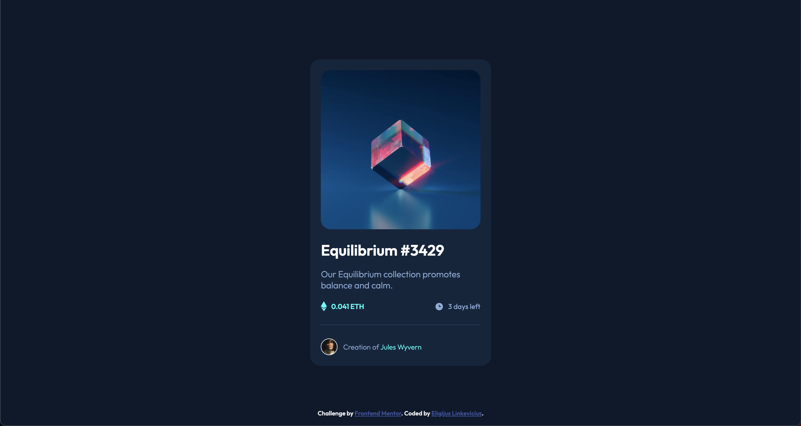

# Frontend Mentor - NFT preview card component solution

This is a solution to the [NFT preview card component challenge on Frontend Mentor](https://www.frontendmentor.io/challenges/nft-preview-card-component-SbdUL_w0U). Frontend Mentor challenges help you improve your coding skills by building realistic projects.

## Table of contents

- [Overview](#overview)
  - [The challenge](#the-challenge)
  - [Screenshot](#screenshot)
  - [Links](#links)
- [My process](#my-process)
  - [Built with](#built-with)
  - [Continued development](#continued-development)
- [Author](#author)

## Overview

### The challenge

Users should be able to:

- View the optimal layout depending on their device's screen size
- See hover states for interactive elements (not on card's image).

### Screenshot

### Links

- Solution URL: (https://github.com/eligijuslinkevicius/nft-preview-card-component)
- Live Site URL: (https://eligijuslinkevicius.github.io/nft-preview-card-component/)

## My process

### Built with

- Semantic HTML5 markup
- CSS custom properties
- Flexbox
- CSS Grid
- Mobile-first workflow
- Sass

### Continued development

Need to learn how to add overlay to pictures when hovering.

## Author

- Frontend Mentor - [@eligijuslinkevicius](https://www.frontendmentor.io/profile/eligijuslinkevicius)
- Twitter - [@thelinkev](https://www.twitter.com/thelinkev)
